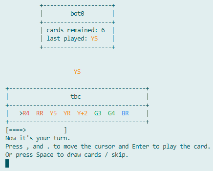

[简体中文](./README.md) | English

# UNO


Hooray! Card game **UNO**!

## Demo


*a game of 3 players*

## Install

### Download executable

Visit [Releases](https://github.com/Gusabary/UNO/releases) page to download executable directly.

### Build from source code

Of course you can also build from source code.

#### Prerequisite

+ Make sure your CMake version is >= 3.14
+ Make sure your C++ compiler has C++17 support

  | Platform | Build                                                        |
  | -------- | ------------------------------------------------------------ |
  | Linux    | gcc 8.4.0   |
  | Windows  | MSVC 19.28 (Visual Studio 16 2019)   |
  | MacOS    | AppleClang 10.0.1   |

#### Start building

Clone the repository and run the build script:

```bash
git clone git@github.com:Gusabary/UNO.git
cd UNO/script

# for linux and mac
chmod +x ./build.sh
./build.sh

# for windows
.\build.bat
```

After the build process, `uno` executable will be under `build/src` directory.

(If encounter some problems related to git submodule when building, take this [issue](https://github.com/Gusabary/UNO/issues/1) for a reference)

Optionally, `uno` can be installed by running:

```shell
make install
```

Also, you can specify CMake option `BUILD_TEST` and `ENABLE_LOG` to build test and log.

Browse Wiki to see complete info about [build options](https://github.com/Gusabary/UNO/wiki/Configuration).

## Getting started

It's recommended to use VSCode built-in terminal. There might be an annoying blink effect in most of other terminals, which negatively affects player experience.

### Start your first game

```shell
./uno -c 8.133.165.59:20020 -u username
```

`-c` indicates the address of the game service and `-u` indicates the username of player.

`8.133.165.59:20020` is a pre-started game service, which is a 2-player game and includes a bot (so you'll play with it). If this service has been occupied, you can try another service on port 20021 ~ 20024.

Browse Wiki to see more about [configuration info](https://github.com/Gusabary/UNO/wiki/Configuration) and [pre-started game services](https://github.com/Gusabary/UNO/wiki/Prestarted-Game-Services).

After entering the game, UI is like below:



Just like what the hint text shows, press `,` or `.` to move the cursor, press Enter to play the card denoted by the cursor and press Space to skip (i.e. draw a card, unless the last played card is Skip card).

Browse Wiki to see complete introduction to [UI and operation mode](https://github.com/Gusabary/UNO/wiki/UI-and-Operation-Mode), and the [game rules](https://github.com/Gusabary/UNO/wiki/Game-Rules) which might be a little different from UNO you've played.

### Start your own game service

```
./uno -l 9091
```

`-l` indicated the port your game service will listen on.

Server started, player can connect to it with `./uno -c localhost:9091`. If the machine on which server is running has a public IP (e.g. `x.y.z.w`), players can connect to it with `./uno -c x.y.z.w:9091`. (If failure, check network configuration like firewall, security group and port mapping to make sure your service is correctly exposed)

Optionally, specify `-n` argument to set the number of players of the game service. (default is 3)

## To-do

- [ ] Improve player experience about network
- [ ] Chinese support in the game
- [ ] Better support for Windows platform
- [ ] Perfect the details of UNO rules
- [ ] Configure keyboard mappings
- [ ] Find suitable Unicode characters to represent Reverse and Skip card
- [ ] Unique banner

Browse Wiki to see detailed [requirements of to-do features](https://github.com/Gusabary/UNO/wiki/Requirements-of-Todo-Features).

*Help Wanted！*

## Miscellaneous

The gadget cost me on and off most of this semester. My intention is to learn [Asio network library](http://think-async.com/Asio/index.html) and modern C++ language features with practice and the game itself is just something like a tool or medium. So there is still some flaw about game rules of UNO and player experience. However, with the thousands of lines of code, my comprehension and use of modern C++ is indeed improved, including smart pointers, rvalue reference, lambda expressions and concurrency. Also, I was trying to use some C++17 features like structural binding, constexpr if, `std::optional` and so on, although it seems that they are used not so reasonably somewhere.

Anyway, the past is in the past. If you are interested and have spare time, welcome to join us to make the gadget better. If not, that's also fine. Start an exciting online UNO game with your friends!

## License

[MIT](./LICENSE)